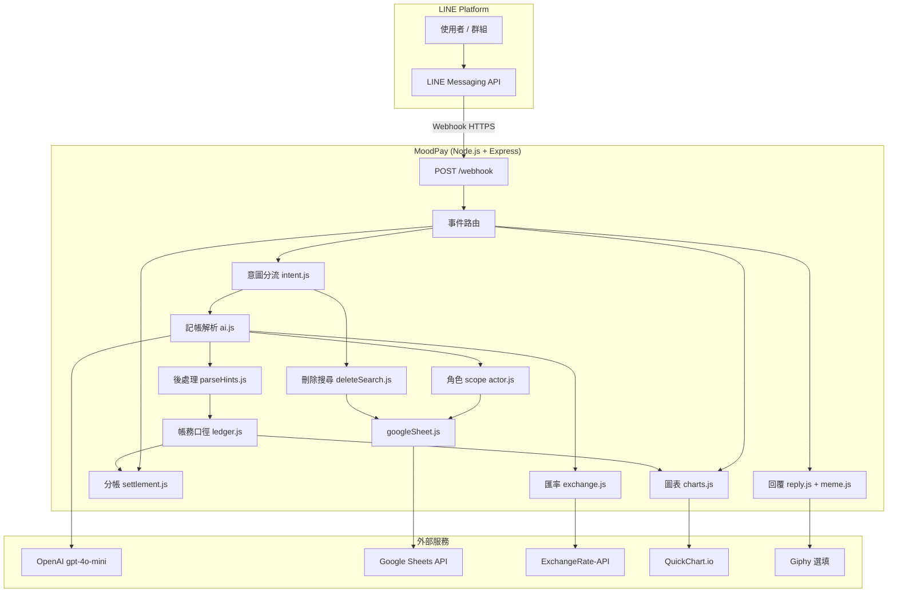

# MoodPay 💸

LINE AI 多人記帳與分帳 Bot（v1.3.0）。用繁體中文自然語言記帳，自動匯率換算、寫入 Google Sheet、計算代墊／欠款，並以 QuickChart 產生圖表與幽默回覆。

---

## 目錄

- [系統架構](#系統架構)
- [請求處理流程](#請求處理流程)
- [核心概念](#核心概念)
- [專案結構](#專案結構)
- [Google Sheet 資料模型](#google-sheet-資料模型)
- [分帳邏輯](#分帳邏輯)
- [指令與自然語言](#指令與自然語言)
- [環境變數](#環境變數)
- [本機開發](#本機開發)
- [部署與 24hr 運行](#部署與-24hr-運行)
- [測試](#測試)

---

## 系統架構



| 元件 | 技術 |
|------|------|
| HTTP 伺服器 | Express 4 |
| LINE 整合 | `@line/bot-sdk` v9（Webhook middleware + Messaging API） |
| 持久化 | Google Sheets（Service Account） |
| AI | OpenAI `gpt-4o-mini`（記帳 JSON、意圖、幽默句） |
| 圖表 | QuickChart（POST 短網址，避免 LINE 圖片 URL 長度上限） |

**HTTP 端點**

| 路徑 | 方法 | 用途 |
|------|------|------|
| `/` | GET | 服務狀態 JSON |
| `/health` | GET | 健康檢查（部署監控用） |
| `/webhook` | POST | LINE 事件入口（需簽章驗證） |

---

## 請求處理流程

1. LINE 將訊息事件 `POST` 到 `/webhook`；伺服器**立即回 200**，再在背景處理（避免 LINE / Render 逾時）。
2. `index.js` 的 `handleEvent` 只處理 `type === "message"`。
3. 依訊息類型分支：
   - **非文字**（含圖片）→ 提示目前僅支援文字記帳。
   - **文字且以 `/` 開頭** → `handleCommand`（指令表）。
   - **一般文字** → `classifyIntent` → 記帳 / 刪除 / 選號 / 確認 / 取消 / 批次刪除。
4. 記帳：`parseExpense`（AI）→ `applyParseHints` → 匯率 `convertToTWD`（含快取）→ `resolveActorsForStorage` → `appendTransaction` → `generateFunnyReply`。
5. 報表／圖表：一律經 `ledger.summarizeLedger` 加總；讀 Sheet 有 TTL 快取（寫入／刪除時失效）。
6. 以 `replyMessage` 回覆：文字 + 選填圖片（圖表或梗圖）。

```text
文字訊息
    │
    ├─ /開頭 ──────────────► handleCommand
    │
    └─ 一般文字 ──► classifyIntent
                      ├─ delete_confirm ──► 確認刪除（單筆 pending）
                      ├─ delete_cancel ───► 取消 pending 刪除
                      ├─ delete_pick ─────► 多筆刪除選編號
                      ├─ delete_bulk ─────► 批次刪最近 N 筆
                      ├─ delete ──────────► 刪上一筆 / 關鍵字 / 日期+項目
                      └─ record ──────────► handleExpense（AI 記帳）
```

```text
記帳資料流（維護時請沿此單一路徑擴充）
  原文 → ai.parseExpense
      → parseHints.applyParseHints   # 算式、paid_for_me / income / treat
      → googleSheet.appendTransaction（含 recordedBy）
      → ledger.summarizeLedger       # 所有 /chart、/summary KPI
```

**刪除流程（關鍵字 / 日期搜尋）**

1. `parseDeleteQuery`（`deleteSearch.js`）解析「5/26的義大利麵」、「5月26日的火鍋」等日期＋項目條件。
2. `findDeletableMatches` 僅搜尋**你自己**記的列（`recordedBy`）。
3. 命中 0 筆 → 提示找不到；1 筆 → 進入 `confirm` 待確認；多筆 → 列出編號，回「刪除 2」選筆後再「確認」。
4. `/undo`、刪上一筆 → 立即刪，不經確認。

**記憶體暫存（重啟會消失）**

| Map | Key | TTL | 用途 |
|-----|-----|-----|------|
| `pendingDeletes` | `chatId::userId` | 5 分鐘 | 刪除 pending；`stage` 為 `pick`（選號）或 `confirm`（待確認） |

---

## 核心概念

### 帳本隔離（`chatId`）

同一支 Google Sheet 可服務多個 LINE 對話，以 `chatId` 區分：

| LINE 來源 | `chatId` |
|-----------|----------|
| 群組 | `groupId` |
| 聊天室 | `roomId` |
| 一對一 | `userId` |

舊資料若沒有 `chatId` 欄，可設環境變數 `LEGACY_CHAT_ID` 指定歸屬哪個帳本。

### 記帳者與角色 scope（`actor.js`）

- 使用者說的 **「我」** 寫入時會換成 **LINE 顯示名稱**。
- **關係人**（如男友）會存成 `男友#Uxxxxxxxx`（加上記帳者 `userId`），避免群組裡不同人的「男友」混在一起。
- 回覆給查看者時會改標籤：自己 →「我」；他人的關係人 →「男友（阿明）」。
- 每筆記錄 `recordedBy` / `recordedByName`（誰在 LINE 上按的）。

### 個人 vs 群組報表

同一 `chatId`（群組／一對一）內，**每人只會看到自己記的帳** 組成個人報表；不會把別人 `recordedBy` 的列算進你的 `/chart`。

| 功能 | 資料範圍 |
|------|----------|
| `/chart`、`/category`、`/monthly`、`/summary`、`/month` | **個人**：`filterTransactionsForViewer`（`recordedBy === 你的 userId`） |
| `/debt`、`/debtchart` | **個人代墊**：僅含**你自己記的** `paid_for_me` / `i_paid` / `shared` 列 |
| `/members` | **群組**：當月每人「自己記帳」的支出加總（戰力榜，非偷看他人私帳） |
| 刪除／`/undo` | **個人**：只能刪 `recordedBy` 為自己的列 |

> 舊資料若缺少 `recordedBy`，會退回比對 payer／consumer 顯示名稱，隔離較不完整；新記帳皆會寫入 `recordedBy`。

### 帳務口徑（`ledger.js`）

所有報表 KPI、分類加總應經 `summarizeLedger()`，避免各處重複計算：

| 欄位 | 說明 |
|------|------|
| `expenseTotal` | 支出合計（正數） |
| `incomeTotal` | 收入合計（正數，如薪水、入帳） |
| `netTotal` | 淨額 = 支出 − 收入 |
| `byCategoryExpense` | 圓餅／排行榜（僅支出） |
| `byCategoryIncome` | 報告「本月收入」區塊 |

### 交易關係 `relation`

| 值 | 語意 | 分帳 | 報表 |
|----|------|------|------|
| `self` | 自己付自己用 | 不產生欠款 | 計入支出 |
| `paid_for_me` | 別人代墊（要還） | consumer 欠 payer | 計入支出 |
| `i_paid` | 我幫別人付 | consumer 欠 payer | 計入支出 |
| `shared` | 多人分攤 | 參與者均分，payer 代墊 | 計入支出 |
| `income` | 收入／入帳（薪水、紅包、塞進錢包） | 不產生欠款 | **收入 +**（拉低淨支出） |
| `treat` | 請客／招待（不用付） | 不產生欠款 | **實付 0**，`item` 可附「價值 N，誰請客」 |

`/debt` 的餘額：**正數** = 別人欠你；**負數** = 你欠別人。顯示時會用 `simplifyDebts` 化簡成「誰還給誰」。

金額以 **台幣 `twdAmount`** 計算分帳（記帳當下依 ExchangeRate-API 換算）。

### 記帳後處理（`parseHints.js`）

AI 解析後會再校正，減少主受詞顛倒、算式算錯：

| 情境 | 處理 |
|------|------|
| `3000+5000-80`、`30x10` | 本地安全計算金額 |
| `被女朋友包養`、`不用付錢` | → `treat`（0 元 + 價值備註，不算債） |
| `男友幫我付` | → `paid_for_me`（代墊，要還） |
| `阿嬤塞進錢包` | → `income`（收入顯示為正） |

### 分類與標籤

- **`category`**：固定英文枚舉（`food`、`travel`、`shopping`…），由 AI 選取後經 `category.js` 正規化。
- **`tags`**：3～6 個繁體中文語意標籤（地點、品牌、活動等），供搜尋與分析，非整句 item 複製。

### 意圖分流（`intent.js`）

優先 **規則**，必要時才呼叫 AI：

| 意圖 | 觸發範例 |
|------|----------|
| `delete` | `刪除上一筆`、`刪除 火鍋`、`刪除 5/26的義大利麵` |
| `delete_pick` | `刪除 2`（多筆 pending 時選編號） |
| `delete_confirm` | `確認`、`確定刪除`、`ok` |
| `delete_cancel` | `取消`、`不要了` |
| `delete_bulk` | `移除這16筆`（最多 50 筆；優先刪 `rawText` 含 `[截圖]` 的列） |
| `record` | 其餘記帳語句 |

含「刪掉、不要這筆、移除以上」等模糊語 → AI 分類（無 API Key 時退回規則）。

金額 ≤ 0 預設拒絕寫入；`income`、`treat` 或訊息含「免費、不用付錢、請客」等則允許（`isExplicitFreeContext`）。

---

## 專案結構

```text
ai-split-bot/
├── index.js                    # Express、Webhook、事件與指令編排
├── package.json
├── .env.example
├── credentials/
│   └── credentials.json.example   # Google Service Account（勿 commit 真檔）
├── services/
│   ├── ai.js                   # 自然語言記帳 → JSON
│   ├── parseHints.js           # 算式金額、relation 校正、income / treat
│   ├── ledger.js               # 帳務口徑（支出／收入／淨額、個人帳本）
│   ├── intent.js               # 刪除 / 記帳意圖（含批次、確認、取消）
│   ├── deleteSearch.js         # 刪除查詢：日期＋項目關鍵字解析
│   ├── actor.js                # 我 / 關係人 scope、個人篩選、顯示標籤
│   ├── googleSheet.js          # Sheet CRUD、快取、欄位初始化
│   ├── exchange.js             # 多幣別 → TWD（含匯率快取）
│   ├── settlement.js           # 欠款餘額、化簡還款邊
│   ├── charts.js               # QuickChart URL、本月上下文
│   ├── chartSummary.js         # 圖表配套文案（產品語氣）
│   ├── category.js             # category / tags 正規化
│   ├── tagEnrich.js            # 標籤補強（內部使用）
│   ├── reply.js                # 記帳 / 刪除幽默回覆
│   ├── meme.js                 # 規則梗 + Giphy 搜尋
│   └── moodVoice.js            # 品牌語氣、金額格式
├── utils/
│   ├── chatId.js               # LINE source → chatId
│   ├── pendingKey.js           # 群組 pending 狀態 key
│   ├── date.js                 # MOODPAY_TIMEZONE、交易時間格式
│   ├── formatter.js            # /help、欠款、錯誤訊息
│   └── chartTheme.js           # 圖表深色 fintech 主題
├── .github/workflows/
│   └── test.yml                # CI：npm test
├── docs/
│   └── NOTION.md               # Notion 匯入用長文文件
└── scripts/
    ├── run-all-tests.js        # npm test 入口（15 套件）
    ├── test-pending-key.js
    ├── test-delete-search.js
    ├── test-intent-flow.js
    ├── test-parse-hints.js
    ├── test-category.js
    ├── test-tags.js
    ├── test-ledger.js
    ├── test-google-sheet.js
    ├── test-sheet-cache.js
    ├── test-exchange.js
    ├── test-settlement.js
    ├── test-actor.js
    ├── test-date.js
    └── test-charts.js
```

---

## Google Sheet 資料模型

工作表名稱：`Transactions`（不存在時自動建立）。

| 欄位 | 說明 |
|------|------|
| `date` | 記帳時間（依 `MOODPAY_TIMEZONE`） |
| `payer` | 付款人（可能含 `#userId` scope） |
| `consumer` | 受益人 |
| `item` | 消費項目 |
| `amount` | 原幣金額 |
| `currency` | TWD / MYR / USD / JPY / KRW |
| `twdAmount` | 換算台幣 |
| `relation` | self / paid_for_me / i_paid / shared / income / treat |
| `category` | 英文分類 |
| `tags` | 標籤（序列化儲存） |
| `rawText` | 使用者原文 |
| `id` | 唯一 ID |
| `chatId` | LINE 帳本 ID |
| `recordedBy` | 記帳者 LINE userId |
| `recordedByName` | 記帳者顯示名稱 |
| `sharedWith` | 分攤參與者（逗號分隔，`shared` 時必填） |

### Google Cloud 設定

1. [Google Cloud Console](https://console.cloud.google.com/) 建立專案，啟用 **Google Sheets API**。
2. 建立 **Service Account**，下載 JSON → `credentials/credentials.json`。
3. 試算表將 Service Account email 加為**編輯者**。
4. 網址中的 Sheet ID 填入 `GOOGLE_SHEET_ID`。

憑證載入順序：`GOOGLE_CREDENTIALS_JSON`（環境變數整份 JSON）→ `GOOGLE_CREDENTIALS_PATH` 檔案 → `credentials/credentials.json` → 專案根目錄 `credentials.json`。讀取後會自動把 `private_key` 裡的字面 `\n` 轉成真換行（避免 `DECODER routines::unsupported`）。

---

## 分帳邏輯

以每筆交易的 `twdAmount` 與 `relation` 更新各人淨餘額（見 `settlement.js` 的 `calculateBalances`）。

**範例語句與解析**

| 使用者輸入 | 典型 relation |
|------------|----------------|
| 我買了 80 元便當 | `self` |
| 男友幫我付 25 馬幣火鍋 | `paid_for_me`（代墊要還） |
| 我幫小胖付了 500 台幣 | `i_paid` |
| 我跟男友一起吃 1200 日幣拉麵 | `shared` |
| 薪水 50000、阿嬤塞 3000 進錢包 | `income` |
| 被請吃 buffet 不用付，價值 30 萬 | `treat`（0 元，備註價值，不算債） |
| 花了 3000+5000-80 的錢 | `self`（金額 7920，由算式計算） |

---

## 指令與自然語言

### 斜線指令

| 指令 | 說明 |
|------|------|
| `/help` | 使用說明 |
| `/debt` | **你的**代墊結算文字 |
| `/summary` | 個人本月報告（支出／收入／淨額 KPI） |
| `/month` | 個人本月簡短摘要 |
| `/chart` | 個人 Dashboard 橫條圖 + KPI 文案 |
| `/category` | 個人已分類圓餅圖（排除 `other` 主導的灰牆） |
| `/monthly` | 個人每日**支出**折線圖 |
| `/debtchart` | **你的**代墊長條圖 |
| `/members` | 群組戰力榜（每人自己記的支出） |
| `/undo` | 刪除**你自己**最後一筆（立即刪） |
| `/delete 關鍵字` | 依項目刪除（例：`/delete 火鍋`；單筆需確認，多筆先選號） |

圖表指令回傳 **文字 + 圖片**；若 QuickChart URL 過長或失敗，僅回文字並註明略過圖表。

### 自然語言（非 `/`）

- **記帳**：直接描述消費、收入（例：薪水 50000）、請客（例：被請吃不用付）。
- **刪除上一筆**：`刪除上一筆`、`移除上一筆資料`、`/undo` → 立即刪，不經確認。
- **依關鍵字 / 日期刪除**：`刪除 火鍋`、`刪除 5/26的義大利麵` → 找到後需回「確認」；多筆時先 `刪除 2` 選號再確認。
- **批次刪除**：`移除這16筆` → 刪除最近 N 筆自己記的帳（截圖匯入列優先以 `[截圖]` 標記匹配）。
- **取消**：pending 刪除中可回「取消」放棄。
- 無法刪除他人記的列（僅 `recordedBy` 為自己的列）。

---

## 環境變數

複製範例後編輯：

```bash
cp .env.example .env
```

### 必填

| 變數 | 說明 |
|------|------|
| `LINE_CHANNEL_ACCESS_TOKEN` | LINE Messaging API 長期 Token |
| `LINE_CHANNEL_SECRET` | Channel Secret |
| `OPENAI_API_KEY` | OpenAI API Key |
| `GOOGLE_SHEET_ID` | 試算表 ID |
| `EXCHANGE_API_KEY` | [ExchangeRate-API](https://www.exchangerate-api.com/) Key |

### 選填

| 變數 | 說明 |
|------|------|
| `PORT` | HTTP port（預設 `3000`；雲端通常由平台注入） |
| `MOODPAY_TIMEZONE` | IANA 時區，例 `Asia/Taipei` |
| `LEGACY_CHAT_ID` | 無 `chatId` 舊列歸屬的 LINE ID |
| `GOOGLE_CREDENTIALS_JSON` | 整份 Service Account JSON（雲端常用，勿 commit） |
| `GOOGLE_CREDENTIALS_PATH` | 自訂憑證檔路徑 |
| `GIPHY_API_KEY` | 記帳／刪除附梗圖（LINE 用 still JPEG，非 GIF） |
| `SHEET_CACHE_TTL_MS` | Sheet 全表讀取快取 TTL（毫秒，預設 `30000`） |
| `EXCHANGE_CACHE_TTL_MS` | 匯率快取 TTL（毫秒，預設 `3600000`） |

---

## 本機開發

### 安裝與啟動

```bash
npm install
cp .env.example .env
# 編輯 .env、放置 credentials/credentials.json

npm run dev    # nodemon
# 或
npm start
```

### LINE Webhook（本機需隧道）

1. 啟動 Bot 後執行 `ngrok http 3000`（或同 `PORT`）。
2. LINE Developers → Messaging API → Webhook URL：
   `https://<你的-ngrok網域>/webhook`
3. 開啟 **Use webhook**，關閉 **Auto-reply messages**。
4. 用 `GET https://<網域>/health` 確認服務存活。

> 本機 + ngrok：**關電腦或關 ngrok 即斷線**。ngrok 免費網址重開常會變，需同步更新 LINE Webhook。

---

## 部署與 24hr 運行

Bot 必須在**有固定 HTTPS 網址的伺服器**上執行，LINE 才能隨時 `POST /webhook`。

### 平台選擇（免費取向）

| 方案 | 24hr | 說明 |
|------|------|------|
| **Oracle Cloud Always Free VM** | ✅ | 真正常駐；需自行裝 Node、HTTPS（Nginx/Caddy） |
| **Render 免費 Web Service** | ⚠️ | 閒置約 15 分鐘休眠；可搭配 [UptimeRobot](https://uptimerobot.com) 每 10 分鐘 `GET /health` 喚醒 |
| **本機 + ngrok** | ❌ | 僅開發測試，不適合正式使用 |

### Render 部署步驟（摘要）

1. 程式碼推上 GitHub（勿提交 `.env`、`credentials/credentials.json`）。
2. [Render Dashboard](https://dashboard.render.com) → **New Web Service** → 連 repo。
3. **Build**: `npm install` · **Start**: `npm start` · **Runtime**: Node ≥ 18。
4. **Environment**：填入所有必填變數。
5. **Google 憑證**（二選一）：
   - **Secret File**（建議）：路徑 `credentials/credentials.json`，貼上**完整** Service Account JSON（從 Google Cloud 下載的原始檔，勿手動改 `private_key` 換行）。
   - **Environment**：`GOOGLE_CREDENTIALS_JSON` = 整份 JSON 一行（`private_key` 內保留 `\n` 跳脫字元即可）。
6. 部署完成後 Webhook：`https://<服務名>.onrender.com/webhook`。

若日誌出現 `error:1E08010C:DECODER routines::unsupported`，代表私鑰 PEM 壞掉：重新下載 JSON、檢查 Secret File 是否被截斷，或改用 `GOOGLE_CREDENTIALS_JSON` 並重新部署。
7. （免費方案）UptimeRobot 監控 `https://<服務名>.onrender.com/health`，間隔 5～10 分鐘。

### 相關後台網址

| 服務 | 網址 |
|------|------|
| LINE 設定 | https://developers.line.biz/console/ |
| Render | https://dashboard.render.com |
| OpenAI | https://platform.openai.com |
| Google Cloud | https://console.cloud.google.com |

---

## 測試

不需啟動 LINE、Google Sheet 或 OpenAI，在專案根目錄執行：

```bash
npm test                    # 跑全部 15 套件（CI 同款）
npm run test:intent         # 意圖分流（含確認 / 批次刪除）
npm run test:parse-hints    # 算式、relation、income / treat 校正
npm run test:delete-search  # 刪除查詢日期＋項目解析
npm run test:category       # 分類正規化
npm run test:tags           # 標籤補強
npm run test:charts         # QuickChart URL
npm run test:ledger         # 帳務口徑、個人篩選
npm run test:google-sheet   # sharedWith 列映射
npm run test:sheet-cache    # Sheet 讀取快取 TTL
npm run test:exchange       # 匯率換算與快取
npm run test:pending-key    # 群組 pending 狀態 key
```

GitHub Actions（Node 20）會在 push / PR 至 `main` / `master` 時自動執行 `npm test`（見 `.github/workflows/test.yml`）。

### 已知限制（後續可改）

- **舊列無 `recordedBy`**：個人報表隔離依賴暱稱 fallback，建議補欄或遷移。
- **舊列無 `sharedWith`**：`shared` 交易重讀後仍 fallback 為 payer／consumer 兩人分攤；新記帳會寫入完整名單。

---

## 授權

MIT License
