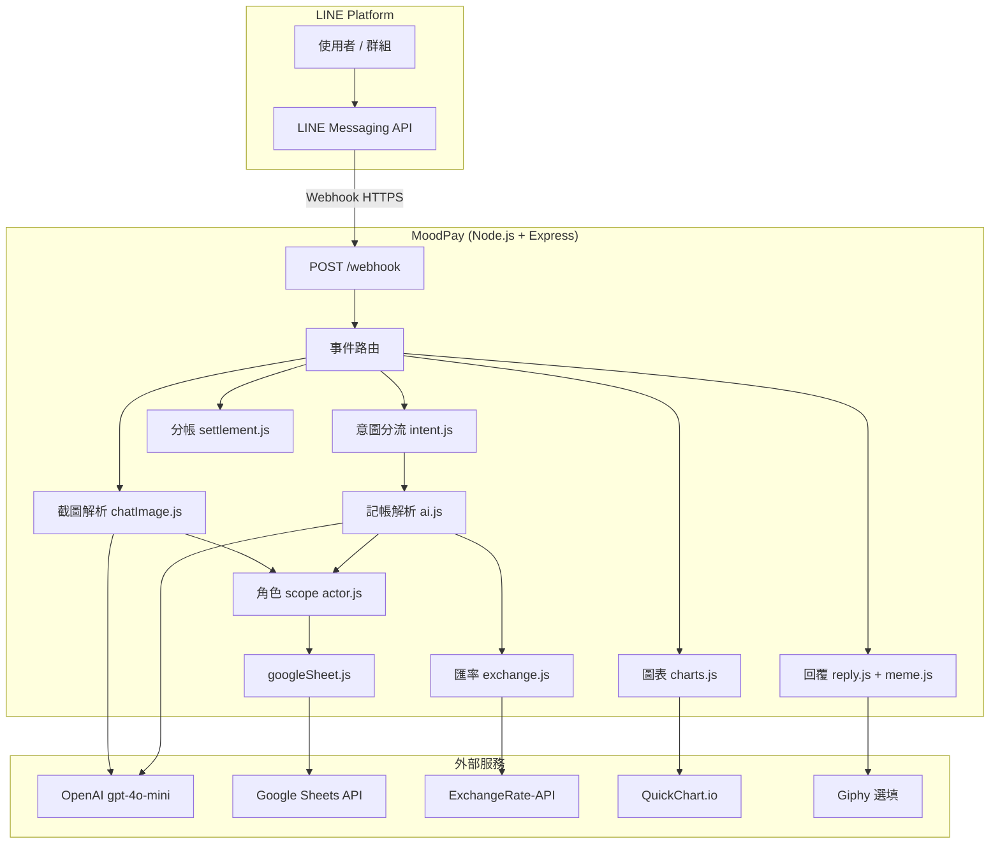

# MoodPay 💸

LINE AI 多人記帳與分帳 Bot。用繁體中文自然語言記帳，自動匯率換算、寫入 Google Sheet、計算代墊／欠款，並以 QuickChart 產生圖表與幽默回覆。

---

## 目錄

- [系統架構](#系統架構)
- [請求處理流程](#請求處理流程)
- [核心概念](#核心概念)
- [專案結構](#專案結構)
- [Google Sheet 資料模型](#google-sheet-資料模型)
- [分帳邏輯](#分帳邏輯)
- [指令與自然語言](#指令與自然語言)
- [環境變數](#環境變數)
- [本機開發](#本機開發)
- [部署與 24hr 運行](#部署與-24hr-運行)
- [測試腳本](#測試腳本)

---

## 系統架構



| 元件 | 技術 |
|------|------|
| HTTP 伺服器 | Express 4 |
| LINE 整合 | `@line/bot-sdk` v9（Webhook middleware + Messaging API） |
| 持久化 | Google Sheets（Service Account） |
| AI | OpenAI `gpt-4o-mini`（記帳 JSON、意圖、截圖 Vision、幽默句） |
| 圖表 | QuickChart（POST 短網址，避免 LINE 圖片 URL 長度上限） |

**HTTP 端點**

| 路徑 | 方法 | 用途 |
|------|------|------|
| `/` | GET | 服務狀態 JSON |
| `/health` | GET | 健康檢查（部署監控用） |
| `/webhook` | POST | LINE 事件入口（需簽章驗證） |

---

## 請求處理流程

1. LINE 將訊息事件 `POST` 到 `/webhook`。
2. `index.js` 的 `handleEvent` 只處理 `type === "message"`。
3. 依訊息類型分支：
   - **圖片** → 下載 → Vision 解析截圖 → 暫存 `pendingImports`（5 分鐘）→ 回分析文字，等使用者回「匯入」。
   - **文字且以 `/` 開頭** → `handleCommand`（指令表）。
   - **一般文字** → `classifyIntent` → 記帳 / 刪除 / 匯入確認 / 刪除編號。
4. 記帳：`parseExpense` → 匯率 `convertToTWD` → `resolveActorsForStorage` → `appendTransaction` → `generateFunnyReply`（可附 Giphy 靜態圖）。
5. 以 `replyMessage` 回覆：文字 + 選填圖片（圖表或梗圖）。

```text
文字訊息
    │
    ├─ /開頭 ──────────────► handleCommand
    │
    └─ 一般文字 ──► classifyIntent
                      ├─ import_confirm ─► 寫入 pending 的截圖列
                      ├─ delete_pick ─────► 多筆刪除選編號
                      ├─ delete ──────────► 刪除上一筆 / 關鍵字
                      └─ record ──────────► handleExpense（AI 記帳）
```

**記憶體暫存（重啟會消失）**

| Map | TTL | 用途 |
|-----|-----|------|
| `pendingImports` | 5 分鐘 | 截圖分析結果，等「匯入」 |
| `pendingDeletes` | 5 分鐘 | 關鍵字刪除命中多筆時，等「刪除 2」 |

---

## 核心概念

### 帳本隔離（`chatId`）

同一支 Google Sheet 可服務多個 LINE 對話，以 `chatId` 區分：

| LINE 來源 | `chatId` |
|-----------|----------|
| 群組 | `groupId` |
| 聊天室 | `roomId` |
| 一對一 | `userId` |

舊資料若沒有 `chatId` 欄，可設環境變數 `LEGACY_CHAT_ID` 指定歸屬哪個帳本。

### 記帳者與角色 scope（`actor.js`）

- 使用者說的 **「我」** 寫入時會換成 **LINE 顯示名稱**。
- **關係人**（如男友）會存成 `男友#Uxxxxxxxx`（加上記帳者 `userId`），避免群組裡不同人的「男友」混在一起。
- 回覆給查看者時會改標籤：自己 →「我」；他人的關係人 →「男友（阿明）」。
- 每筆記錄 `recordedBy` / `recordedByName`（誰在 LINE 上按的）。

### 個人 vs 全帳本報表

| 功能 | 資料範圍 |
|------|----------|
| `/chart`、`/category`、`/monthly`、`/summary`、`/month` | **個人 scope**：只含該使用者 `recordedBy` 記下的列（同 `chatId`） |
| `/debt`、`/debtchart` | **整個 chatId** 所有交易 |
| `/members` | **整個 chatId** 當月（看誰花最多） |

### 交易關係 `relation`

| 值 | 語意 | 分帳效果 |
|----|------|----------|
| `self` | 自己付自己用 | 不產生欠款 |
| `paid_for_me` | 別人幫我付 | consumer 欠 payer |
| `i_paid` | 我幫別人付 | consumer 欠 payer |
| `shared` | 多人分攤 | 參與者均分，payer 代墊全額 |

`/debt` 的餘額：**正數** = 別人欠你；**負數** = 你欠別人。顯示時會用 `simplifyDebts` 化簡成「誰還給誰」。

金額以 **台幣 `twdAmount`** 計算分帳（記帳當下依 ExchangeRate-API 換算）。

### 分類與標籤

- **`category`**：固定英文枚舉（`food`、`travel`、`shopping`…），由 AI 選取後經 `category.js` 正規化。
- **`tags`**：3～6 個繁體中文語意標籤（地點、品牌、活動等），供搜尋與分析，非整句 item 複製。

### 意圖分流（`intent.js`）

優先 **規則**，必要時才呼叫 AI：

- `刪除 …`、`/undo` → 刪除
- `刪除 2` → 多筆刪除選號
- `匯入` → 確認截圖匯入
- 含「刪掉、不要這筆」等模糊語 → AI 分類

金額 ≤ 0 預設拒絕寫入；訊息含「免費、請客、0元」等則允許（`isExplicitFreeContext`）。

---

## 專案結構

```text
ai-split-bot/
├── index.js                    # Express、Webhook、事件與指令編排
├── package.json
├── .env.example
├── credentials/
│   └── credentials.json.example   # Google Service Account（勿 commit 真檔）
├── services/
│   ├── ai.js                   # 自然語言記帳 → JSON
│   ├── intent.js               # 刪除 / 匯入 / 記帳意圖
│   ├── actor.js                # 我 / 關係人 scope、個人篩選、顯示標籤
│   ├── googleSheet.js          # Sheet CRUD、欄位初始化
│   ├── exchange.js             # 多幣別 → TWD
│   ├── settlement.js           # 欠款餘額、分類加總、化簡還款邊
│   ├── charts.js               # QuickChart URL、本月上下文
│   ├── chartSummary.js         # 圖表配套文案（產品語氣）
│   ├── chatImage.js            # LINE 圖片下載 + Vision 截圖 OCR
│   ├── chatImageRules.js       # 截圖正負號、日期、匯入設定
│   ├── category.js             # category / tags 正規化
│   ├── tagEnrich.js            # 標籤補強（內部使用）
│   ├── reply.js                # 記帳 / 刪除幽默回覆
│   ├── meme.js                 # 規則梗 + Giphy 搜尋
│   └── moodVoice.js            # 品牌語氣、金額格式
├── utils/
│   ├── chatId.js               # LINE source → chatId
│   ├── date.js                 # MOODPAY_TIMEZONE、交易時間格式
│   ├── formatter.js            # /help、欠款、截圖分析、錯誤訊息
│   └── chartTheme.js           # 圖表深色 fintech 主題
└── scripts/
    ├── test-intent-flow.js
    ├── test-category.js
    ├── test-charts.js
    ├── test-chat-image.js
    ├── test-tags.js
    ├── test-settlement.js
    ├── test-actor.js
    └── test-date.js
```

---

## Google Sheet 資料模型

工作表名稱：`Transactions`（不存在時自動建立）。

| 欄位 | 說明 |
|------|------|
| `date` | 記帳時間（依 `MOODPAY_TIMEZONE`） |
| `payer` | 付款人（可能含 `#userId` scope） |
| `consumer` | 受益人 |
| `item` | 消費項目 |
| `amount` | 原幣金額 |
| `currency` | TWD / MYR / USD / JPY / KRW |
| `twdAmount` | 換算台幣 |
| `relation` | self / paid_for_me / i_paid / shared |
| `category` | 英文分類 |
| `tags` | 標籤（序列化儲存） |
| `rawText` | 使用者原文 |
| `id` | 唯一 ID |
| `chatId` | LINE 帳本 ID |
| `recordedBy` | 記帳者 LINE userId |
| `recordedByName` | 記帳者顯示名稱 |

### Google Cloud 設定

1. [Google Cloud Console](https://console.cloud.google.com/) 建立專案，啟用 **Google Sheets API**。
2. 建立 **Service Account**，下載 JSON → `credentials/credentials.json`。
3. 試算表將 Service Account email 加為**編輯者**。
4. 網址中的 Sheet ID 填入 `GOOGLE_SHEET_ID`。

憑證載入順序：`GOOGLE_CREDENTIALS_JSON`（環境變數整份 JSON）→ `GOOGLE_CREDENTIALS_PATH` 檔案 → `credentials/credentials.json` → 專案根目錄 `credentials.json`。讀取後會自動把 `private_key` 裡的字面 `\n` 轉成真換行（避免 `DECODER routines::unsupported`）。

---

## 分帳邏輯

以每筆交易的 `twdAmount` 與 `relation` 更新各人淨餘額（見 `settlement.js` 的 `calculateBalances`）。

**範例語句與解析**

| 使用者輸入 | 典型 relation |
|------------|----------------|
| 我買了 80 元便當 | `self` |
| 男友幫我付 25 馬幣火鍋 | `paid_for_me` |
| 我幫小胖付了 500 台幣 | `i_paid` |
| 我跟男友一起吃 1200 日幣拉麵 | `shared` |

---

## 指令與自然語言

### 斜線指令

| 指令 | 說明 |
|------|------|
| `/help` | 使用說明 |
| `/debt` | 代墊結算文字（全帳本） |
| `/summary` | 個人本月支出文案速覽 |
| `/month` | 個人本月簡短摘要 |
| `/chart` | 個人 Dashboard 橫條圖 + KPI 文案 |
| `/category` | 個人已分類圓餅圖（排除 `other` 主導的灰牆） |
| `/monthly` | 個人每日支出折線圖 |
| `/debtchart` | 欠款長條圖 |
| `/members` | 成員消費排行（全帳本當月） |
| `/undo` | 刪除最後一筆 |
| `/delete [關鍵字]` | 刪除符合項目；無關鍵字則刪最後一筆 |

圖表指令回傳 **文字 + 圖片**；若 QuickChart URL 過長或失敗，僅回文字並註明略過圖表。

### 自然語言（非 `/`）

- **記帳**：直接描述消費。
- **刪除**：`刪除上一筆`、`刪除 火鍋`、`刪除 2`（多筆時）。
- **截圖匯入**：傳圖片 → 回覆分析 → 回「匯入」寫入。

### 聊天截圖匯入

1. 傳送 LINE 聊天記帳截圖。
2. Bot 用 Vision 擷取每筆金額與項目。
3. **正數** = `CHAT_IMPORT_POSITIVE_PAYER` 幫 `CHAT_IMPORT_USER` 付；**負數** = 反向。
4. 回「匯入」後批次寫入 Sheet。

---

## 環境變數

複製範例後編輯：

```bash
cp .env.example .env
```

### 必填

| 變數 | 說明 |
|------|------|
| `LINE_CHANNEL_ACCESS_TOKEN` | LINE Messaging API 長期 Token |
| `LINE_CHANNEL_SECRET` | Channel Secret |
| `OPENAI_API_KEY` | OpenAI API Key |
| `GOOGLE_SHEET_ID` | 試算表 ID |
| `EXCHANGE_API_KEY` | [ExchangeRate-API](https://www.exchangerate-api.com/) Key |

### 選填

| 變數 | 說明 |
|------|------|
| `PORT` | HTTP port（預設 `3000`；雲端通常由平台注入） |
| `MOODPAY_TIMEZONE` | IANA 時區，例 `Asia/Taipei` |
| `LEGACY_CHAT_ID` | 無 `chatId` 舊列歸屬的 LINE ID |
| `GOOGLE_CREDENTIALS_JSON` | 整份 Service Account JSON（雲端常用，勿 commit） |
| `GOOGLE_CREDENTIALS_PATH` | 自訂憑證檔路徑 |
| `GIPHY_API_KEY` | 記帳／刪除附梗圖（LINE 用 still JPEG，非 GIF） |
| `CHAT_IMPORT_POSITIVE_PAYER` | 截圖正數付款人（預設 `男友`） |
| `CHAT_IMPORT_USER` | 截圖中的「我」（預設 `我`） |
| `CHAT_IMPORT_CURRENCY` | 截圖預設幣別（預設 `MYR`） |
| `CHAT_IMPORT_YEAR` | 截圖日期缺年份時補上 |

---

## 本機開發

### 安裝與啟動

```bash
npm install
cp .env.example .env
# 編輯 .env、放置 credentials/credentials.json

npm run dev    # nodemon
# 或
npm start
```

### LINE Webhook（本機需隧道）

1. 啟動 Bot 後執行 `ngrok http 3000`（或同 `PORT`）。
2. LINE Developers → Messaging API → Webhook URL：
   `https://<你的-ngrok網域>/webhook`
3. 開啟 **Use webhook**，關閉 **Auto-reply messages**。
4. 用 `GET https://<網域>/health` 確認服務存活。

> 本機 + ngrok：**關電腦或關 ngrok 即斷線**。ngrok 免費網址重開常會變，需同步更新 LINE Webhook。

---

## 部署與 24hr 運行

Bot 必須在**有固定 HTTPS 網址的伺服器**上執行，LINE 才能隨時 `POST /webhook`。

### 平台選擇（免費取向）

| 方案 | 24hr | 說明 |
|------|------|------|
| **Oracle Cloud Always Free VM** | ✅ | 真正常駐；需自行裝 Node、HTTPS（Nginx/Caddy） |
| **Render 免費 Web Service** | ⚠️ | 閒置約 15 分鐘休眠；可搭配 [UptimeRobot](https://uptimerobot.com) 每 10 分鐘 `GET /health` 喚醒 |
| **本機 + ngrok** | ❌ | 僅開發測試，不適合正式使用 |

### Render 部署步驟（摘要）

1. 程式碼推上 GitHub（勿提交 `.env`、`credentials/credentials.json`）。
2. [Render Dashboard](https://dashboard.render.com) → **New Web Service** → 連 repo。
3. **Build**: `npm install` · **Start**: `npm start` · **Runtime**: Node ≥ 18。
4. **Environment**：填入所有必填變數。
5. **Google 憑證**（二選一）：
   - **Secret File**（建議）：路徑 `credentials/credentials.json`，貼上**完整** Service Account JSON（從 Google Cloud 下載的原始檔，勿手動改 `private_key` 換行）。
   - **Environment**：`GOOGLE_CREDENTIALS_JSON` = 整份 JSON 一行（`private_key` 內保留 `\n` 跳脫字元即可）。
6. 部署完成後 Webhook：`https://<服務名>.onrender.com/webhook`。

若日誌出現 `error:1E08010C:DECODER routines::unsupported`，代表私鑰 PEM 壞掉：重新下載 JSON、檢查 Secret File 是否被截斷，或改用 `GOOGLE_CREDENTIALS_JSON` 並重新部署。
7. （免費方案）UptimeRobot 監控 `https://<服務名>.onrender.com/health`，間隔 5～10 分鐘。

### 相關後台網址

| 服務 | 網址 |
|------|------|
| LINE 設定 | https://developers.line.biz/console/ |
| Render | https://dashboard.render.com |
| OpenAI | https://platform.openai.com |
| Google Cloud | https://console.cloud.google.com |

---

## 測試腳本

不需啟動 LINE，可在專案根目錄執行：

```bash
npm run test:intent      # 意圖分流
npm run test:category    # 分類 / tags
npm run test:charts      # 圖表 URL
npm run test:chat-image  # 截圖規則（需圖檔時見腳本說明）
npm run test:tags
```

另有 `scripts/test-settlement.js`、`test-actor.js`、`test-date.js` 可直接 `node scripts/...` 執行。

---

## 授權

MIT License
